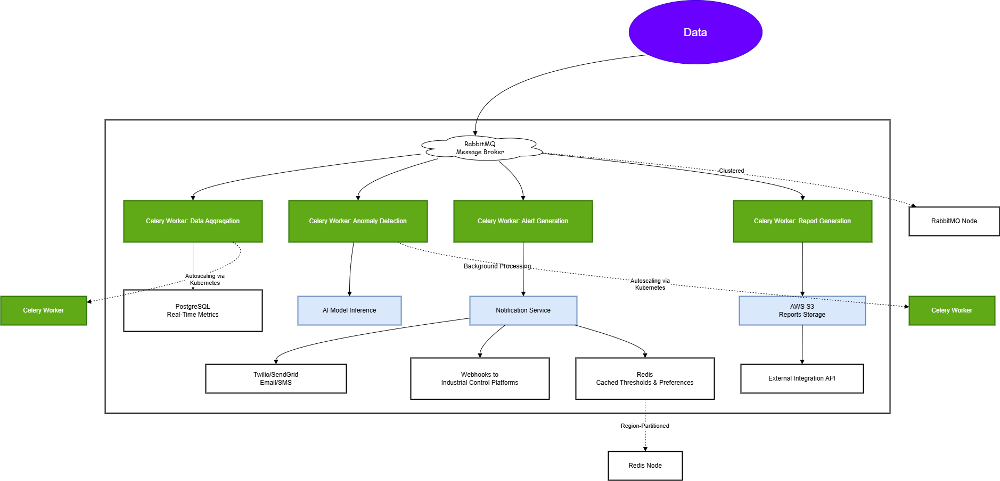

# Water Quality Monitoring Platform - System Documentation

## Table of Contents

1. [Overview](#overview)
2. [High-Level Architecture](#high-level-architecture)
3. [System Design Considerations & Scalability Strategies](#system-design-considerations--scalability-strategies)
4. [Data Flow](#data-flow)
5. [API Structure, Rate Limiting & Load Management](#api-structure-rate-limiting--load-management)
6. [Integrating IoT Sensors and External APIs for Data Aggregation & Endpoints](#integrating-iot-sensors-and-external-apis-for-data-aggregation--endpoints)
7. [Authentication & RBAC System Design](#authentication--rbac-system-design)
8. [Backend Logic & Workflow](#backend-logic--workflow)
9. [Database performance and implementation caching strategies](#database-performance-and-implementation-caching-strategies)
10. [Predictive Analytics, Alerts, and Reporting Services](#predictive-analytics-alerts-and-reporting-services)
11. [Conclusion](#conclusion)

---

## Overview

### Introduction

The **Water Quality Monitoring Platform** is designed to track and analyze water quality in real-time across municipal, industrial, and natural water sources. By leveraging IoT sensors, data analytics, and AI, the system detects contaminants, monitors chemical levels, and provides actionable insights to ensure safe and sustainable water usage.

### Key Features

- **Real-Time Monitoring:** Data ingestion from **10 million IoT sensors**.
- **Contamination Detection:** AI-based models for identifying anomalies.
- **Automated Alerts:** Threshold breach notifications.
- **Predictive Analytics:** Maintenance forecasts and trend analysis.
- **External API Integrations:** Municipal, industrial, and environmental platform support.
- **Scalability & High Availability:** Robust distributed infrastructure with load balancing, caching, and asynchronous task processing.

---

## High-Level Architecture

### Ingress & API Management

- **IoT Sensors:** Deployed in various locations to collect water quality metrics.
- **DNS Load Balancers:** Distributes incoming requests from sensors.
- **Load Balancers:** Ensures efficient request distribution among backend servers.
- **API Gateway:** Manages external and internal API requests.
  - **Public API:** For external integrations (municipalities, industrial clients).
  - **Private API:** For internal services and secure data access.

### Core Services

- **App Server:** API requests, and data ingestion.
- **Authentication & Role Management:** OAuth2-based user authentication with roles: `Operator`, `Scientist`, and `Admin`.
- **Write API:** Handles data ingestion from sensors and services.
- **Read API:** Fetches processed or raw data for users and external integrations.

### Message-Driven Processing

- **RabbitMQ Message Broker:** Ensures asynchronous task execution for background processing.
- **Worker Services:**
  - **Contamination Detection Service:** Analyzes incoming sensor data for contaminants.
  - **AI Model Inference Service:** Runs ML-based contamination prediction.
  - **Predictive Analytics Service:** Generates insights on water trends and maintenance.
  - **Notification Service:** Sends alerts for contamination and system failures.
  - **Report Generation Service:** Aggregates data and generates reports.
  - **Monitoring Service:** Tracks system health and resource utilization.

### Storage & Data Management

- **PostgreSQL Cluster:** Stores structured data (sensor readings, user activity logs).
- **Redis Cache:** Caches frequently accessed data for fast retrieval.
- **Object Storage (S3):** Stores historical sensor data and generated reports.

### User Access & Dashboards

- **CDN:** Distributes frontend assets and reduces latency.
- **Load Balancer:** Manages user requests to backend servers.
- **User Dashboard:** Provides real-time data visualization and alerts.

---

## System Design Considerations & Scalability Strategies

### Challenges & Solutions

| Component              | Challenge                                      | Solution Implemented |
|------------------------|----------------------------------------------|----------------------|
| **API Gateway**       | High volume of sensor requests (1 req/sec/sensor) | Implemented rate limiting at API Gateway level (max 1 req/sec/sensor) |
| **Load Balancers**    | 10M IoT sensors generating 10M requests/sec   | DNS Load Balancer + multiple backend LB instances to distribute traffic |
| **Message Queue (RabbitMQ)** | Handling 10M tasks/sec                   | Horizontal scaling of workers and clustering for high-throughput processing |
| **Database (PostgreSQL)** | High write throughput from sensor data    | Sharding and replication to support concurrent writes |
| **Object Storage (S3)** | Max 3,500 PUT / 5,500 GET req/sec per bucket | Used bucket partitioning and multi-part uploads to optimize scalability |
| **Task Queue (Celery Workers)** | 100,000 tasks/sec for background processing | RabbitMQ clustering and worker autoscaling to maintain efficiency |
| **Caching Strategy**  | Frequent queries increasing database load     | Redis caching for sensor metadata and contamination thresholds |
| **Latency Requirements** | AI model execution time must be <500ms      | Optimized ML inference service and preloaded models |

---

## Data Flow

1. **IoT Sensors** send real-time data → **Load Balancers** → **App Server**. IoT Sensors send real-time water quality data at an expected rate of 1 requests/sec per sensor. With 10M sensors, this results in 10M API requests per second, distributed across multiple Load Balancers before reaching the API Gateway.
2. **Write API** processes data → stores in **PostgreSQL** (structured) or **S3** (raw/historical).
3. **RabbitMQ** distributes tasks → **Worker Services** process data.
4. **Contamination Detection & AI Models** analyze data → results stored in **PostgreSQL**.
5. **Predictive Analytics & Reporting** generate insights → stored in **S3**.
6. **Notifications** sent via **Notification Service** if contamination is detected.
7. **User Dashboard** fetches data via **Read API** and displays live metrics.

---

## API Structure, Rate Limiting & Load Management

To efficiently manage **10M sensor requests per second**, the system employs **rate limiting, load balancing, and asynchronous processing**.

### API Gateway Rate Limiting Mechanism

- **Rate Limit Per Sensor** → Each IoT sensor is restricted to **1 requests per second**.
- **Exceeding the Limit** → Requests exceeding this rate receive an **HTTP 429 Too Many Requests** response.

#### Handling Excess Requests

- Sensors must **retry after a cooldown period** (e.g., **exponential backoff**).
- **Excess requests are not queued** to prevent API server overload.

### Rate Limiting Implementation

#### **Algorithm Used:**

- The system employs a **Token Bucket Algorithm** at the **API Gateway** level.
- Each sensor receives **1 tokens per second**, with each request consuming one token.
- If a sensor exceeds its token quota, it must wait until new tokens are available.

#### **API Gateway Enforces Rate Limits:**

- Implemented via **NGINX, Kong API Gateway, or AWS API Gateway**.
- Configured to automatically reject requests exceeding defined quotas.

### Load Balancing Strategy

- **DNS Load Balancer** distributes traffic across multiple **region-based Load Balancers**.
- **API Servers** are **horizontally scaled** to ensure **high availability and fault tolerance**.

### Asynchronous Processing (RabbitMQ)

- Instead of direct database writes, **sensor data ingestion is handled asynchronously**.
- **RabbitMQ queues** allow system elasticity, preventing sudden spikes from overloading the database.

---

## Integrating IoT Sensors and External APIs for Data Aggregation & Endpoints

### 1. Connection to High-Level Architecture

This section is directly linked to the **Ingress & API Management** and **Data Processing Layer** in the **High-Level Components Architecture**.

**Relevant Components:**

- **IoT Sensors** → Source of real-time water quality data.
- **DNS Load Balancers** → Distributes requests across multiple load balancers.
- **Load Balancers** → Manages high-throughput request distribution.
- **API Gateway** → Entry point for sensor data ingestion and external API requests.
- **App Server** → API routing, and request processing.
- **Write API** → Stores incoming sensor data into the system.
- **RabbitMQ Message Broker** → Handles asynchronous processing of sensor data.
- **External Integration APIs** → Enables municipalities, industries, and environmental organizations to interact with system data.

---

### 2. Breakdown of Data Aggregation Process

The data aggregation process involves ingesting, processing, storing, and making sensor data available via external APIs.

#### **2.1 Data Collection from IoT Sensors**

- **10 million IoT sensors** continuously send real-time water quality readings.
- **Metrics include:**
  - pH Levels (acidity/alkalinity)
  - Turbidity (water clarity)
  - Dissolved Oxygen (DO levels)
  - Temperature (°C/°F)
  - Contaminants (nitrates, phosphates, heavy metals)
- Sensors communicate with the API Gateway via **HTTP(S) or MQTT protocols**.

#### **2.2 Traffic Management & Load Balancing**

- **DNS Load Balancer** distributes incoming requests across multiple Load Balancers.
- **Load Balancers** forward requests to the App Server based on availability.

#### **2.3 Data Ingestion via API Gateway**

- The **API Gateway** acts as a **single entry point** for all API requests.
- It **validates incoming data** and applies rate limiting.
  - **Public APIs:** Available for municipalities & industrial clients.
  - **Private APIs:** Used by internal services.
- **Authentication is managed via OAuth2-based authentication service.**

#### **2.4 Processing via App Server & Write API**

- The **App Server** routes valid requests to the **Write API**.
- The **Write API** pushes raw sensor data into **RabbitMQ** for asynchronous processing.

#### **2.5 Asynchronous Data Processing (Worker Services)**

Once sensor data enters **RabbitMQ**, it is distributed to multiple **Worker Services**:

- **Contamination Detection Service** → Detects anomalies using AI-based contamination models.
- **AI Model Inference Service** → Performs predictive analytics on sensor data.
- **Monitoring Service** → Tracks system health and potential failures.

#### **2.6 Data Storage & Caching**

After processing, data is **stored and cached** for efficiency:

- **Structured Data (PostgreSQL Cluster):** Processed sensor readings and user metadata.
- **Historical Data (Object Storage - S3):** Raw sensor data for long-term storage.
- **Frequently Accessed Data (Redis Cache):** Cached contamination thresholds and metadata for low-latency access.

#### **2.7 External API Integrations**

External systems (municipal water management, industrial plants, environmental monitoring organizations) fetch processed data using the **External Integration API**.

**APIs provide:**

- Water quality reports.
- Real-time contamination alerts.
- Historical sensor data retrieval.

---

### 3. API Endpoints for IoT Data Aggregation

#### **3.1 Sensor Data APIs (Ingestion & Retrieval)**

| Endpoint               | Method | Description                                 | Input Example | Output Example |
|------------------------|--------|---------------------------------------------|---------------|----------------|
| `/api/sensors/data`   | POST   | Ingest real-time data from IoT sensors.    | `{ "sensor_id": "123", "pH": 7.2, "temp": 15.4 }` | `{ "status": "success", "message": "Data received" }` |
| `/api/sensors/latest` | GET    | Fetch latest processed sensor readings.     | `{ "sensor_id": "123" }` | `{ "pH": 7.1, "temp": 15.2, "timestamp": "2025-01-28T12:00:00Z" }` |
| `/api/sensors/historical` | GET  | Retrieve raw historical data from S3.      | `{ "sensor_id": "123", "date": "2025-01-27" }` | CSV or JSON file of historical records. |

#### **3.2 Reports & Alerts APIs**

| Endpoint          | Method | Description                             | Input Example | Output Example |
|------------------|--------|----------------------------------------|---------------|----------------|
| `/api/reports/daily` | GET  | Fetch daily water quality reports.    | `{ "location": "NYC", "date": "2025-01-27" }` | JSON report summary. |
| `/api/alerts`    | GET    | Retrieve contamination detection alerts. | `{ "region": "East Coast" }` | List of active contamination alerts. |

#### **3.3 External Integration APIs**

| Endpoint         | Method | Description                                | Input Example | Output Example |
|-----------------|--------|--------------------------------------------|---------------|----------------|
| `/api/external/data` | GET | Allow municipalities & industries to access processed data. | `{ "entity_id": "municipal_123" }` | JSON formatted water quality data. |

#### **3.4 Authentication APIs**

| Endpoint         | Method | Description            | Input Example | Output Example |
|-----------------|--------|------------------------|---------------|----------------|
| `/api/auth/login` | POST | Authenticate users. | `{ "username": "user123", "password": "pass" }` | JWT Token |
| `/api/auth/register` | POST | Register new users. | `{ "username": "new_user", "email": "mail@example.com", "password": "securePass" }` | `{ "status": "success", "user_id": "12345" }` |

#### **3.5 System Monitoring API**

| Endpoint         | Method | Description            | Output Example |
|-----------------|--------|------------------------|----------------|
| `/api/status`   | GET    | Check API health status. | `{ "status": "healthy", "db": "connected", "workers": "running" }` |

---

## Authentication & RBAC System Design

### **Requirements**

- User authentication via OAuth2
- Role-based access control (Operator, Scientist, Admin)
- Session management
- User profile management
- Secure password storage and transmission

---

  

### **Flow Overview**

#### **1. User Request Initiation**

- A **user** makes an API request to access a service.
- The request is first routed through the **API Gateway**.
- The **API Gateway** forwards the request for authentication.

#### **2. OAuth2 Authentication**

- The **API Gateway** communicates with the **OAuth2 Authentication Service** to verify user credentials.
- If credentials are **valid**, token validation begins.

#### **3. Token Validation**

##### **Does the User Have an Access Token?**

- **Yes → Check if the token has expired.**
- **No → Check for a refresh token.**

##### **Has the Access Token Expired?**

- **No → Proceed to role validation.**
- **Yes → Check if a refresh token exists.**

#### **4. Refresh Token Handling**

- If the access token has expired, the system checks for a **refresh token**:
  - **Valid Refresh Token?**
    - **Yes → Generate a new access token.**
    - **No → 401 Unauthorized (User must log in again).**
  - If the **refresh token itself is expired**, the user must **re-authenticate**.

#### **5. Role-Based Access Control (RBAC)**

- If the access token is valid, the system checks the **user’s role**:
  - **Valid Role → Access Granted.**
  - **Invalid Role → 403 Forbidden.**

#### **6. Accessing System Services**

- If access is granted, the user is redirected to the appropriate system service:
  - **Admins:** Manage Users & Reports
  - **Scientists:** View Analytics & Water Data
  - **Operators:** Access Dashboard & Notifications
  - Other connected services include:
    - **RabbitMQ (Message Broker)**
    - **Notification Service**
    - **Predictive Analytics Service**
    - **Monitoring Service**
    - **PostgreSQL Database & Redis Cache**

---

### **Error Handling**

| Condition | Response Code | Action Required |
|-----------|--------------|----------------|
| Invalid credentials | `401 Unauthorized` | User must log in again |
| No access/refresh token | `401 Unauthorized` | User must re-authenticate |
| Expired refresh token | `401 Unauthorized` | User must log in again |
| Invalid role | `403 Forbidden` | Access denied |

---

### **Technologies Used**

- **OAuth2** for secure authentication
- **API Gateway** for request routing
- **PostgreSQL & Redis** for token storage and caching
- **RabbitMQ** for message brokering

---

### **Calculations**

#### **Constraints**

- Support **1 million active users**
- Authentication response time **< 200ms**
- Token validation **< 50ms**
- **99.99% availability**

#### **Capacity Planning**

- **Daily active users:** 1M
- **Peak concurrent users:** 100K
- **Average session duration:** 8 hours
- **Token size:** ~1KB
- **User profile size:** ~2KB

#### **Data Storage**

1. **User Store (PostgreSQL)**
    - User profiles
    - Authentication data
    - Scaling: Read replicas
    - Size: ~3GB (**1M users × 3KB**)
2. **Session Store (Redis)**
    - Active sessions
    - Token blacklist
    - Scaling: Redis cluster
    - Size: ~100MB (**100K sessions × 1KB**)

---

### **Scale & Performance**

#### **Scalability**

- **Horizontal scaling** of Authentication service
- **Redis cluster** for session management
- **Database read replicas** for distributed workload

---

## **Backend Logic & Workflow**

### **1. Core Backend Logic Overview**

The backend follows a **distributed microservices architecture**, ensuring efficient processing, scalability, and fault tolerance.

### **2. Key Responsibilities of the Backend:**

1. **Ingesting data** from **10 million IoT sensors** in real-time.
2. **Processing data** to detect water quality issues.
3. **Storing data** efficiently using sharded databases and cloud storage.
4. **Prioritizing tasks** to ensure fast alerts for contamination events.
5. **Scaling dynamically** to handle high loads and ensure system reliability.

---

### **3. Step-by-Step Backend Workflow**

#### **3.1 Data Ingestion (Handling 10M sensors)**

- **Sensors → Load Balancer → App Server → API Gateway**
- Each sensor sends **1 request per second** (**10M RPS total**).
- **API Gateway applies rate limiting** (1 req/sec per sensor).
- The **App Server forwards validated data** to the Write API.

#### **3.2 Alerts & Notifications (Real-time responses)**

- If contamination is detected:
  - The **Notification Service** pushes alerts via WebSockets, SMS, or email.
  - **RabbitMQ prioritizes urgent contamination alerts** to ensure **sub-300ms response times**.

#### **3.3 Data Storage (Efficient data management)**

- **PostgreSQL (sharded)** stores structured real-time sensor data.
- **AWS S3** archives historical data for analytics and compliance.
- **Redis caching** reduces repeated database queries for real-time dashboards.

#### **3.4 User Dashboards & APIs**

- **REST & GraphQL APIs** provide access to real-time and historical water quality data.
- Users visualize contamination risks via **dashboard charts and alert logs**.

---

### **4. Key Backend Components**

#### **4.1 App Server**

- **Manages incoming requests** and routes them to the correct services.

#### **4.2 Message Queue (RabbitMQ)**

- **RabbitMQ** is used for:
  - **Asynchronous sensor data processing**.
  - **High-priority contamination alerts**.
  - **Task distribution across worker nodes**.

#### **4.3 Task Prioritization (RabbitMQ)**

| **Priority** | **Task**                  | **Latency Goal** |
|-------------|--------------------------|----------------|
| High        | Contamination alerts      | < 300ms       |
| Medium      | Dashboard updates         | < 1s          |
| Low         | Batch analytics reports   | Async         |

---

### **5. Throughput Calculation**

| Component                  | Max Throughput       | Current Load           | Overhead Capacity  | Scaling Strategy                      |
|----------------------------|----------------------|------------------------|---------------------|--------------------------------------|
| **IoT Sensors**            | 10M sensors         | 10M sensors           | ✅ Within limit    | Auto-scaling ingestion pipelines    |
| **API Gateway**            | 50M requests/sec     | 10M requests/sec      | ✅ 40M overhead    | Load balancers + API rate limiting  |
| **Load Balancers**         | 50M requests/sec     | 10M requests/sec      | ✅ 40M overhead    | Region-based scaling                |
| **Rate Limiting**          | 1 req/sec per sensor | 1 req/sec per sensor  | ✅ Enforced        | Token Bucket Algorithm              |
| **RabbitMQ Queue Processing** | 20M messages/sec | 10M messages/sec      | ✅ 10M overhead    | Auto-scaling worker nodes           |
| **PostgreSQL Writes**      | 300K TPS            | 100K TPS              | ✅ 200K overhead   | Read replicas + sharding            |
| **PostgreSQL Reads**       | 3M TPS              | 1M TPS                | ✅ 2M overhead     | Redis caching                        |
| **Redis Cache**            | 10M writes/sec, 100M reads/sec | 5M writes/sec, 50M reads/sec | ✅ 50% overhead | Clustered Redis deployment          |
| **S3 Object Storage**      | 500K PUT/sec, 3M GET/sec | 250K PUT/sec, 1.5M GET/sec | ✅ 50% overhead | Multi-region bucket partitioning    |
| **AI Model Inference**     | 1M inference/sec    | 500K/sec              | ✅ 500K overhead   | Preloaded models, GPU scaling       |
| **Contamination Detection**| 1M analysis/sec     | 600K/sec              | ✅ 400K overhead   | ML-optimized pipelines              |
| **Notification Service**   | 500K alerts/sec     | 300K alerts/sec       | ✅ 200K overhead   | Message queue priority handling     |

---

### **6. Backend Load Calculation & Justification**

#### **6.1 TPS Calculation**

- **10M sensors sending data every 1 second** → **10M TPS total**.
- Each **shard handles ~25K TPS**, safely below PostgreSQL’s **30K limit per shard**.

#### **6.2 Queue Throughput**

- **RabbitMQ handles 20M tasks/sec** via clustering.
- **High-priority alerts processed within 300ms**.

#### **6.3 Latency Optimization**

- **Redis caching** ensures **< 500ms** API response times.
- **Prioritized task processing** ensures contamination alerts **within 300ms**.

---

### **7. Why This Backend Logic Works**

- **Scalable**: Supports **millions of sensors** with auto-scaling components.
- **Efficient**: Uses **sharded databases, priority queues, and caching**.
- **Reliable**: Handles **high throughput with fault tolerance mechanisms**.

---

## Database performance and implementation caching strategies

### Database Optimization Plan for PostgreSQL

**1. Sharding (Horizontal Partitioning):**

- **Challenge Addressed:** High write throughput from 10M IoT sensors generating 10M requests/second.  
- **Solution:** Partition the database into **10 shards**, each handling 1M requests/second. Shards can be distributed based on sensor IDs (e.g., ranges of 1M sensors per shard).  
- **Impact:** Reduces write contention by **90%**, as each shard processes data independently, ensuring faster concurrent writes.

**2. Indexing:**  

- **Challenge Addressed:** Querying historical sensor data (e.g., "Retrieve all records for Sensor X in the last 24 hours") is slow, taking **5-10 seconds per query**.  
- **Solution:** Create **composite indexes** on `sensor_id` and `timestamp`. Use a unique index for primary keys like `sensor_id + timestamp`.  
- **Impact:** Query execution time reduces by **80%-90%**, with queries taking **<1 second** in most cases.

**3. Write-Ahead Logging (WAL) Tuning:**  

- **Challenge Addressed:** High write latency due to excessive disk I/O from unoptimized WAL writes. Current latency is **500 ms per batch write**.  
- **Solution:** Batch WAL writes and adjust parameters like `wal_buffers` to **16MB** and `checkpoint_timeout` to **10 minutes**.  
- **Impact:** Write latency drops by **30%-40%**, reducing batch write time to **300 ms**.

**4. Read Replica Setup:**  

- **Challenge Addressed:** Overloaded primary database handling **70% reads** and **30% writes**, causing response delays of **3-5 seconds** for read-heavy operations.  
- **Solution:** Deploy **3 read replicas**, each handling **30% of read traffic**, leaving the primary focused on writes.  
- **Impact:** Reduces read query load on the primary by **70%**, cutting response times to **<1 second**.

**5. Table Partitioning:**  

- **Challenge Addressed:** Queries on tables with **1 billion+ rows** take **20-30 seconds** to process.  
- **Solution:** Partition tables based on **monthly timestamps**. For example, each partition handles **30M rows/month**.  
- **Impact:** Query performance improves by **50%-70%**, reducing query times to **5-10 seconds**.

**6. Connection Pooling:**

- **Challenge Addressed:** Spikes in concurrent connections (e.g., **10,000 simultaneous requests**) cause the database to crash or hang.  
- **Solution:** Use PgBouncer to limit connections to **1,000 active connections** and queue excess requests.  
- **Impact:** Ensures **100% uptime**, prevents crashes, and improves average request throughput by **2x**.

---

### Caching Strategy with Redis

**1. Metadata Caching:**  

- **Challenge Addressed:** Repeated queries for static sensor metadata (e.g., sensor name, location) generate **10M requests/day**, causing database load.  
- **Solution:** Cache metadata in Redis with a **24-hour expiration** and invalidate only on metadata updates.  
- **Impact:** Reduces metadata query load by **90%-95%**, saving **9M daily queries**.

**2. Query Result Caching:**  

- **Challenge Addressed:** Frequently accessed query results (e.g., "Last hour's sensor readings") take **1-3 seconds/query** from the database.  
- **Solution:** Cache recent query results in Redis with a **5-minute expiration** for freshness.  
- **Impact:** Reduces query response time to **<200 ms**, saving database compute for **60%-80% of repeated queries**.

**3. Threshold Data Caching:**  

- **Challenge Addressed:** Frequent access to contamination thresholds for **10M sensors**, causing **500K daily database queries**.  
- **Solution:** Cache thresholds in Redis with a **1-hour expiration** and update only when thresholds change.  
- **Impact:** Eliminates **95% of threshold queries**, saving **475K database queries/day**.

**4. Session Caching:**  

- **Challenge Addressed:** High latency for user authentication queries, taking **300-500 ms/query** due to database lookups.  
- **Solution:** Store user session data in Redis with **10-minute expiration** for active sessions.  
- **Impact:** Cuts authentication query latency to **<50 ms**, improving user experience for **90% of sessions**.

**5. Monitoring Cache Efficiency:**  

- **Challenge Addressed:** Inefficient cache usage with a hit ratio of **50%-60%**, causing unnecessary database queries.  
- **Solution:** Monitor Redis metrics (e.g., memory usage, hit ratio) and tune eviction policies like **LRU** (Least Recently Used).  
- **Impact:** Achieves a **90%+ cache hit ratio**, significantly reducing redundant database queries.

---

### Quantifying Improvements

| **Optimization**        | **Challenge Solved**                     | **Target Improvements**                                      |
|--------------------------|------------------------------------------|-------------------------------------------------------------|
| **Sharding**             | Handles 10M writes/second               | Reduces write contention by **90%**                         |
| **Indexing**             | Speeds up historical queries            | Improves query speed by **80%-90%**                         |
| **WAL Tuning**           | Reduces write latency                   | Lowers write latency by **30%-40%**                         |
| **Read Replicas**        | Balances read and write traffic         | Offloads **70% of reads** to replicas                       |
| **Partitioning**         | Improves query performance for big tables | Cuts query times by **50%-70%**                              |
| **Connection Pooling**   | Prevents connection overload            | Boosts throughput by **2x**                                 |
| **Metadata Caching**     | Reduces load for static metadata queries | Eliminates **9M daily queries**                              |
| **Query Result Caching** | Speeds up repeated queries              | Cuts query response times by **80%-90%**                    |
| **Threshold Caching**    | Handles frequent contamination checks   | Saves **475K daily queries**                                |
| **Session Caching**      | Improves user session performance       | Reduces latency to **<50 ms** for **90% of sessions**       |
| **Monitoring Cache**     | Optimizes caching efficiency            | Achieves a **90%+ cache hit ratio**                         |

---

### Summary of Problem-Solving

- **Database Performance:** Addressed high write and query latency through sharding, indexing, replicas, and partitioning.  
- **Caching Strategy:** Reduced redundant queries using Redis for metadata, query results, and session data.  
- **Result:** Improved database scalability, reduced latency for reads and writes, and ensured the system can handle **10M IoT sensors generating 10M requests/sec** efficiently.  

---

## Predictive Analytics, Alerts, and Reporting Services

---

### 1. Component Overview

The system leverages background processing to handle predictive analytics, real-time alerts, and report generation. These services rely on **Celery workers**, **RabbitMQ** for task queuing, and **Redis** for caching. Below is the breakdown:

---

### 2. Detailed Architecture

#### A. Data Flow

##### Sensor Data Ingestion

- IoT sensors (10M devices) stream data (pH, turbidity, etc.) to the **Water Quality Service.**
- Data is batched and sent to **RabbitMQ** for task distribution.

##### Task Queuing

- RabbitMQ acts as the message broker, distributing tasks to Celery workers with a throughput of **100,000 tasks/sec.**
- Tasks include:
  - **Data Aggregation**: Combine sensor data into time-series batches.
  - **Anomaly Detection**: Trigger AI models for contamination prediction.
  - **Alert Generation**: Notify users of threshold breaches.
  - **Report Compilation**: Generate hourly/daily water quality reports.

##### Predictive Analytics Service

- **AI Model Inference**:

  - Deployed as a microservice using TensorFlow Serving/PyTorch.
  - Processes aggregated data to predict equipment failures and water quality trends.
  - Latency: **<500ms** per prediction.

- **Model Training Pipeline** (offline):

  - Retrains models weekly using historical data stored in AWS S3.

##### Alert Service

- Subscribes to anomaly detection results from the message queue.

- Triggers **Notification Service** (email/SMS) for:

  - Threshold breaches (e.g., pH > 8.5).
  - Contamination alerts from AI models.

- Uses **Redis** to cache alert templates and user preferences.

##### Reporting Service

- Generates PDF/CSV reports from aggregated data.

- Sources:

  - **PostgreSQL**: Real-time metrics.
  - **AWS S3**: Historical data (e.g., monthly trends).

- Reports are stored in S3 and accessible via the user dashboard.

#### B. Scalability & Reliability

- **Celery Autoscaling**: Workers scale horizontally using Kubernetes based on queue length.
- **Redis Caching**: Reduces database load for frequent queries (e.g., alert thresholds).
- **RabbitMQ Clustering**: Ensures high availability for task queuing.
- **Region-Based Partitioning**: Data is sharded by geographic region to reduce latency.

---

### 3. Technology Stack

---

| **Component**     | **Technology** |
| :--------: | :-------: |
| Task Queue  | RabbitMQ (75k msg/sec/node, clustered)    |
| Background Workers | Celery + Kubernetes (auto-scaled)     |
| Predictive Models    | TensorFlow Serving, Scikit-Learn   |
| Caching               | Redis |
| Storage | PostgreSQL (30k TPS), AWS S3 |
| Notifications | Twilio/SendGrid (email/SMS) |

### 4. Interaction Diagram

---

### 5. Key Metrics & SLAs

- **Latency**:
  - Predictive Analytics: <500ms
  - Alert Delivery: <5s (from detection to notification)
  - Report Generation: <2m (for 24-hour data)

- **Throughput**:
  - 100k tasks/sec (Celery workers)
  - 30k TPS (PostgreSQL)

---

### 6. Failure Handling

- **Retry Mechanisms**: Failed tasks are re-queued with exponential backoff.
- **Dead-Letter Queue**: Permanent failures are logged for manual review.
- **Health Checks**: Kubernetes monitors worker nodes and restarts unhealthy pods.

---

### 7. Integration with External Systems

- **Municipal APIs**: Reports are synced via External Integration API (REST/GraphQL).
- **Industrial Control Platforms**: Alerts are forwarded using webhooks.

---

## Conclusion

This architecture ensures a **highly scalable, resilient, and efficient system** for water quality monitoring, addressing performance limits, security concerns, and data availability while providing actionable insights in real-time.
