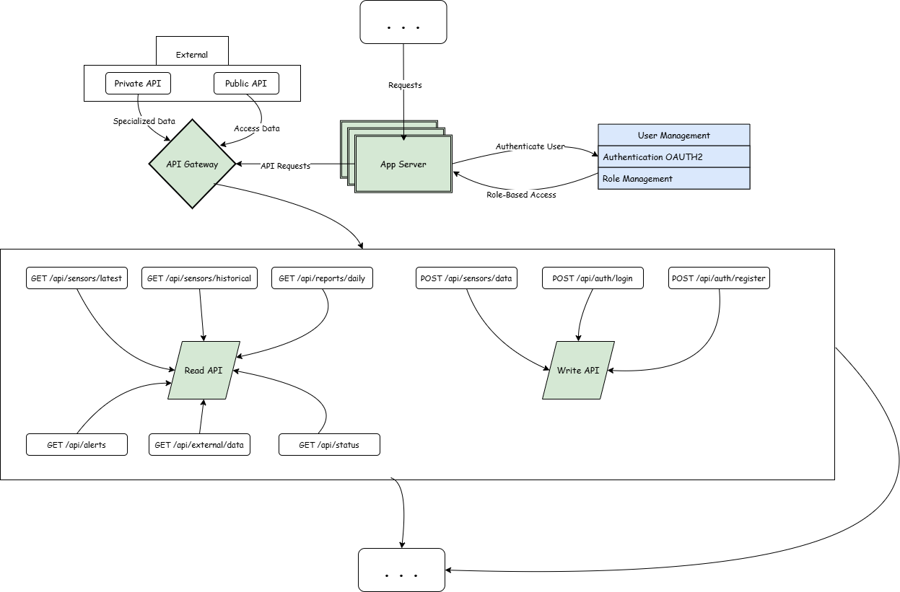

# Integrating IoT Sensors and External APIs for Data Aggregation

## 1. Connection to High-Level Architecture

This section is directly linked to the **Ingress & API Management** and **Data Processing Layer** in the **High-Level Components Architecture**.

**Relevant Components:**

- **IoT Sensors** → Source of real-time water quality data.
- **DNS Load Balancers** → Distributes requests across multiple load balancers.
- **Load Balancers** → Manages high-throughput request distribution.
- **API Gateway** → Entry point for sensor data ingestion and external API requests.
- **App Server** → Manages authentication, API routing, and request processing.
- **Write API** → Stores incoming sensor data into the system.
- **RabbitMQ Message Broker** → Handles asynchronous processing of sensor data.
- **External Integration APIs** → Enables municipalities, industries, and environmental organizations to interact with system data.

---

## 2. Breakdown of Data Aggregation Process

The data aggregation process involves ingesting, processing, storing, and making sensor data available via external APIs.

### **2.1 Data Collection from IoT Sensors**

- **10 million IoT sensors** continuously send real-time water quality readings.
- **Metrics include:**
  - pH Levels (acidity/alkalinity)
  - Turbidity (water clarity)
  - Dissolved Oxygen (DO levels)
  - Temperature (°C/°F)
  - Contaminants (nitrates, phosphates, heavy metals)
- Sensors communicate with the API Gateway via **HTTP(S) or MQTT protocols**.

### **2.2 Traffic Management & Load Balancing**

- **DNS Load Balancer** distributes incoming requests across multiple Load Balancers.
- **Load Balancers** forward requests to the App Server based on availability.

### **2.3 Data Ingestion via API Gateway**

- The **API Gateway** acts as a **single entry point** for all API requests.
- It **validates incoming data**, checks authentication, and applies rate limiting.
  - **Public APIs:** Available for municipalities & industrial clients.
  - **Private APIs:** Used by internal services.
- **Authentication is managed via OAuth2-based authentication service.**

### **2.4 Processing via App Server & Write API**

- The **App Server** routes valid requests to the **Write API**.
- The **Write API** pushes raw sensor data into **RabbitMQ** for asynchronous processing.

### **2.5 Asynchronous Data Processing (Worker Services)**

Once sensor data enters **RabbitMQ**, it is distributed to multiple **Worker Services**:

- **Contamination Detection Service** → Detects anomalies using AI-based contamination models.
- **AI Model Inference Service** → Performs predictive analytics on sensor data.
- **Monitoring Service** → Tracks system health and potential failures.

### **2.6 Data Storage & Caching**

After processing, data is **stored and cached** for efficiency:

- **Structured Data (PostgreSQL Cluster):** Processed sensor readings and user metadata.
- **Historical Data (Object Storage - S3):** Raw sensor data for long-term storage.
- **Frequently Accessed Data (Redis Cache):** Cached contamination thresholds and metadata for low-latency access.

### **2.7 External API Integrations**

External systems (municipal water management, industrial plants, environmental monitoring organizations) fetch processed data using the **External Integration API**.

**APIs provide:**

- Water quality reports.
- Real-time contamination alerts.
- Historical sensor data retrieval.

---

## 3. API Endpoints for IoT Data Aggregation

### **3.1 Sensor Data APIs (Ingestion & Retrieval)**

| Endpoint               | Method | Description                                 | Input Example | Output Example |
|------------------------|--------|---------------------------------------------|---------------|----------------|
| `/api/sensors/data`   | POST   | Ingest real-time data from IoT sensors.    | `{ "sensor_id": "123", "pH": 7.2, "temp": 15.4 }` | `{ "status": "success", "message": "Data received" }` |
| `/api/sensors/latest` | GET    | Fetch latest processed sensor readings.     | `{ "sensor_id": "123" }` | `{ "pH": 7.1, "temp": 15.2, "timestamp": "2025-01-28T12:00:00Z" }` |
| `/api/sensors/historical` | GET  | Retrieve raw historical data from S3.      | `{ "sensor_id": "123", "date": "2025-01-27" }` | CSV or JSON file of historical records. |

### **3.2 Reports & Alerts APIs**

| Endpoint          | Method | Description                             | Input Example | Output Example |
|------------------|--------|----------------------------------------|---------------|----------------|
| `/api/reports/daily` | GET  | Fetch daily water quality reports.    | `{ "location": "NYC", "date": "2025-01-27" }` | JSON report summary. |
| `/api/alerts`    | GET    | Retrieve contamination detection alerts. | `{ "region": "East Coast" }` | List of active contamination alerts. |

### **3.3 External Integration APIs**

| Endpoint         | Method | Description                                | Input Example | Output Example |
|-----------------|--------|--------------------------------------------|---------------|----------------|
| `/api/external/data` | GET | Allow municipalities & industries to access processed data. | `{ "entity_id": "municipal_123" }` | JSON formatted water quality data. |

### **3.4 Authentication APIs**

| Endpoint         | Method | Description            | Input Example | Output Example |
|-----------------|--------|------------------------|---------------|----------------|
| `/api/auth/login` | POST | Authenticate users. | `{ "username": "user123", "password": "pass" }` | JWT Token |
| `/api/auth/register` | POST | Register new users. | `{ "username": "new_user", "email": "mail@example.com", "password": "securePass" }` | `{ "status": "success", "user_id": "12345" }` |

### **3.5 System Monitoring API**

| Endpoint         | Method | Description            | Output Example |
|-----------------|--------|------------------------|----------------|
| `/api/status`   | GET    | Check API health status. | `{ "status": "healthy", "db": "connected", "workers": "running" }` |

---
