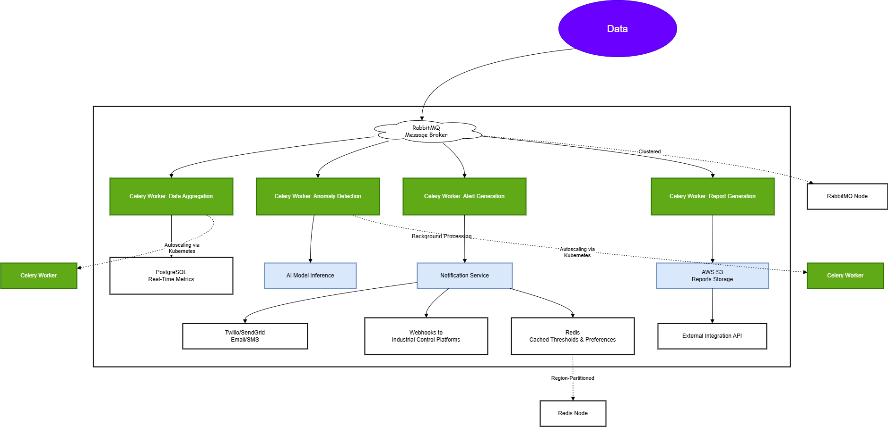

# Documentation: Predictive Analytics, Alerts, and Reporting Services

---

## 1. Component Overview

The system leverages background processing to handle predictive analytics, real-time alerts, and report generation. These services rely on **Celery workers**, **RabbitMQ** for task queuing, and **Redis** for caching. Below is the breakdown:

---

## 2. Detailed Architecture

### A. Data Flow

#### Sensor Data Ingestion

- IoT sensors (10M devices) stream data (pH, turbidity, etc.) to the **Water Quality Service.**

- Data is batched and sent to **RabbitMQ** for task distribution.

#### Task Queuing

- RabbitMQ acts as the message broker, distributing tasks to Celery workers with a throughput of **100,000 tasks/sec.**
- Tasks include:
  - **Data Aggregation**: Combine sensor data into time-series batches.
  - **Anomaly Detection**: Trigger AI models for contamination prediction.
  - **Alert Generation**: Notify users of threshold breaches.
  - **Report Compilation**: Generate hourly/daily water quality reports.

#### Predictive Analytics Service

- **AI Model Inference**:

  - Deployed as a microservice using TensorFlow Serving/PyTorch.

  - Processes aggregated data to predict equipment failures and water quality trends.

  - Latency: **<500ms** per prediction.

- **Model Training Pipeline** (offline):

  - Retrains models weekly using historical data stored in AWS S3.

#### Alert Service

- Subscribes to anomaly detection results from the message queue.

- Triggers **Notification Service** (email/SMS) for:

  - Threshold breaches (e.g., pH > 8.5).

  - Contamination alerts from AI models.

- Uses **Redis** to cache alert templates and user preferences.

#### Reporting Service

- Generates PDF/CSV reports from aggregated data.

- Sources:

  - **PostgreSQL**: Real-time metrics.

  - **AWS S3**: Historical data (e.g., monthly trends).

- Reports are stored in S3 and accessible via the user dashboard.

### B. Scalability & Reliability

- **Celery Autoscaling**: Workers scale horizontally using Kubernetes based on queue length.

- **Redis Caching**: Reduces database load for frequent queries (e.g., alert thresholds).

- **RabbitMQ Clustering**: Ensures high availability for task queuing.

- **Region-Based Partitioning**: Data is sharded by geographic region to reduce latency.

---

## 3. Technology Stack

---

| **Component**     | **Technology** |
| :--------: | :-------: |
| Task Queue  | RabbitMQ (75k msg/sec/node, clustered)    |
| Background Workers | Celery + Kubernetes (auto-scaled)     |
| Predictive Models    | TensorFlow Serving, Scikit-Learn   |
| Caching               | Redis |
| Storage | PostgreSQL (30k TPS), AWS S3 |
| Notifications | Twilio/SendGrid (email/SMS) |

## 4. Interaction Diagram

---

## 5. Key Metrics & SLAs

- **Latency**:
  - Predictive Analytics: <500ms
  - Alert Delivery: <5s (from detection to notification)
  - Report Generation: <2m (for 24-hour data)

- **Throughput**:
  - 100k tasks/sec (Celery workers)
  - 30k TPS (PostgreSQL)

---

## 6. Failure Handling

- **Retry Mechanisms**: Failed tasks are re-queued with exponential backoff.

- **Dead-Letter Queue**: Permanent failures are logged for manual review.

- **Health Checks**: Kubernetes monitors worker nodes and restarts unhealthy pods.

---

## 7. Integration with External Systems

- **Municipal APIs**: Reports are synced via External Integration API (REST/GraphQL).

- **Industrial Control Platforms**: Alerts are forwarded using webhooks.

---

## Next Steps for Implementation

1. Set up RabbitMQ clusters and Celery workers with Kubernetes.

2. Deploy AI models using TensorFlow Serving in a Dockerized environment.

3. Integrate Redis for caching threshold configurations.

4. Build report templates and automate S3 storage sync.

This design ensures low-latency, scalable, and reliable processing for predictive analytics, alerts, and reporting.
